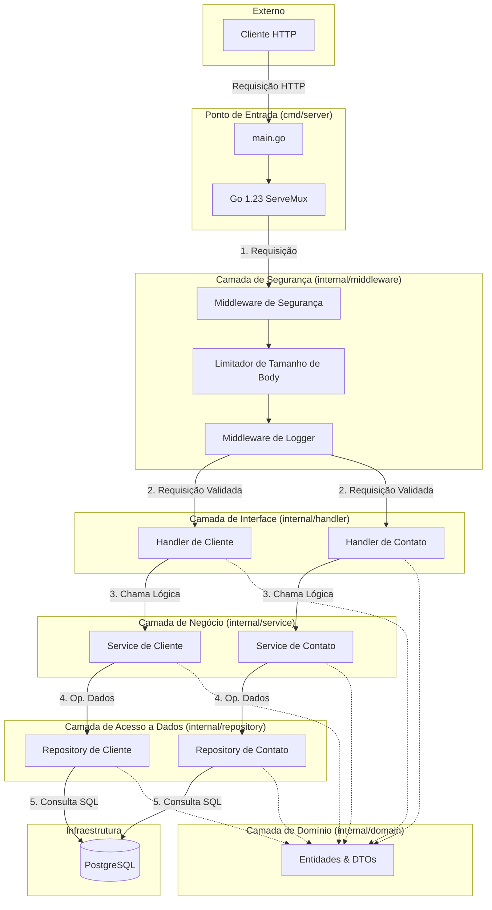

# Arquitetura do Sistema - Desafio Backend Nubank

Este diagrama ilustra a **Clean Architecture** e o **Fluxo de Dados** para a API Go leve e segura.

## Responsabilidades dos Componentes

1.  **Middleware de Segurança**:

    - **Strict-Transport-Security**: Força HTTPS.
    - **CSP & No-Sniff**: Mitiga XSS e MIME-sniffing.
    - **Body Limiter**: Previne DoS via payloads grandes.

2.  **Handlers**:

    - Parseiam entrada JSON.
    - Validam DTOs.
    - Mapeiam erros HTTP.

3.  **Services**:

    - Regras de negócio (ex: "Cliente deve existir para adicionar Contato").
    - Gerenciamento de transação (se necessário).

4.  **Repositories**:
    - Interações puras com banco de dados usando GORM.
    - Sem lógica de negócio.
