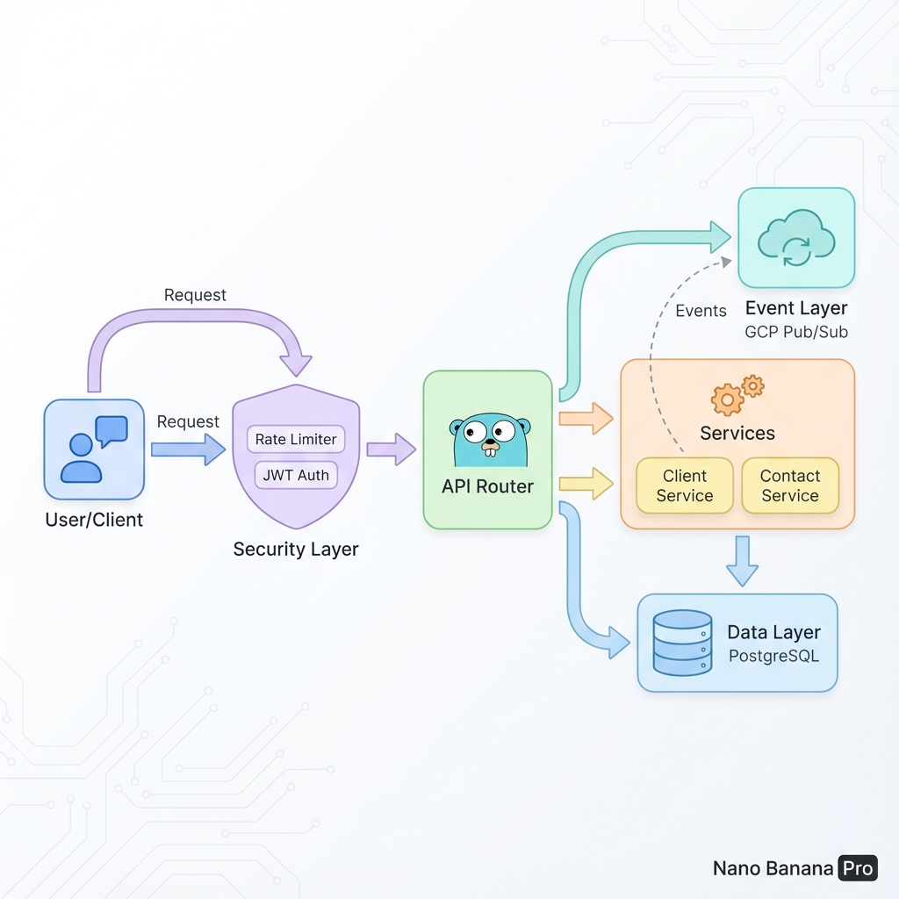

# Arquitetura do Sistema - Desafio Nubank (Go)

Este documento detalha a arquitetura da solução, projetada para ser robusta, segura e escalável.

## Diagrama Visual

## Visão Geral

O sistema adota **Clean Architecture** combinada com **Event-Driven Architecture** (EDA) para operações assíncronas.

### Fluxo de Requisição (Request Flow)

1.  **Client**: Inicia a requisição HTTP (ex: `POST /clientes`).
2.  **Security Layer (Middleware)**:
    - **Rate Limiter**: Protege contra abuso (Token Bucket).
    - **Auth Middleware**: Valida o JWT e injeta o contexto do usuário.
    - **Security Headers**: Adiciona headers de proteção (HSTS, CSP, etc).
3.  **Router (API)**: Roteia a requisição para o Handler apropriado.
4.  **Handler (Interface Adapter)**:
    - Recebe o JSON.
    - Valida dados básicos.
    - Chama o Service.
5.  **Service (Use Cases)**:
    - Executa regras de negócio.
    - Chama o Repository para persistência.
    - **Dispara Evento**: Após sucesso, publica mensagem no Pub/Sub.
6.  **Repository (Data Access)**:
    - Interage com o PostgreSQL via GORM.
7.  **Event Layer (Async)**:
    - **GCP Pub/Sub**: Recebe o evento `new-client-created` para processamento futuro (ex: envio de email, analytics).

## Componentes Chave

| Componente     | Tecnologia    | Responsabilidade                        |
| :------------- | :------------ | :-------------------------------------- |
| **API Server** | Go (net/http) | Servidor HTTP leve e performático.      |
| **Database**   | PostgreSQL    | Persistência relacional robusta.        |
| **Messaging**  | GCP Pub/Sub   | Desacoplamento via eventos assíncronos. |
| **Auth**       | JWT (Go-JWT)  | Autenticação stateless segura.          |
| **Container**  | Docker        | Padronização do ambiente de execução.   |

## Decisões de Design

- **Inversão de Dependência**: Services dependem de Interfaces, não de implementações concretas. Isso facilita testes com Mocks.
- **Segurança em Camadas**: Proteção aplicada no nível de rede (Rate Limit), aplicação (JWT) e dados (Sanitização).
- **Eventos Assíncronos**: O uso de Pub/Sub evita que operações secundárias (ex: notificação) travem a resposta da API principal.
